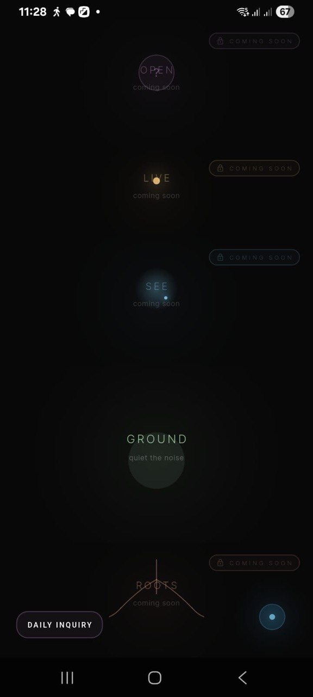
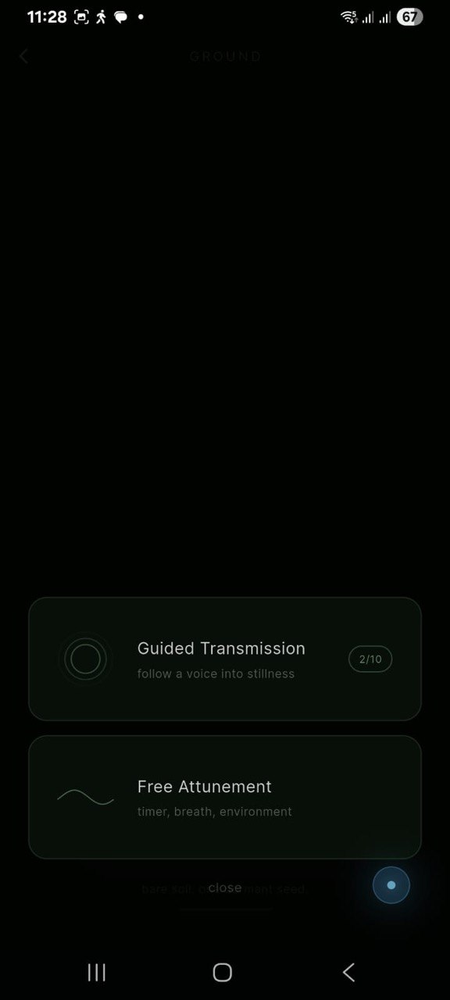
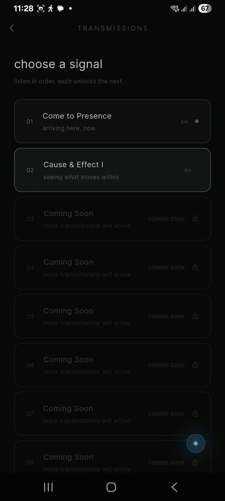
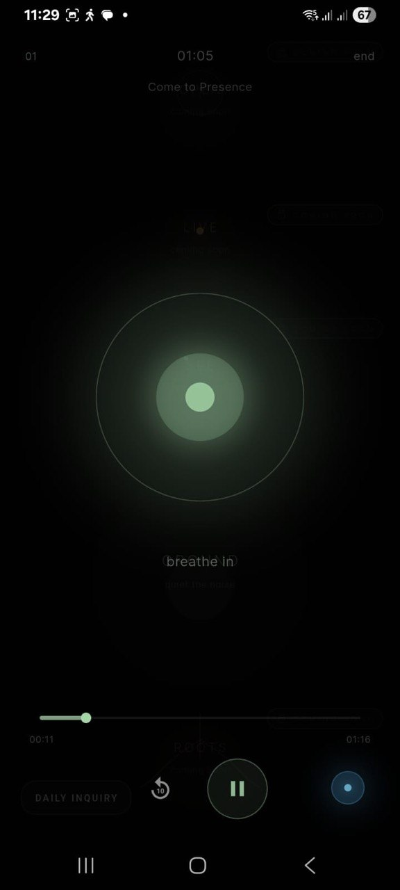
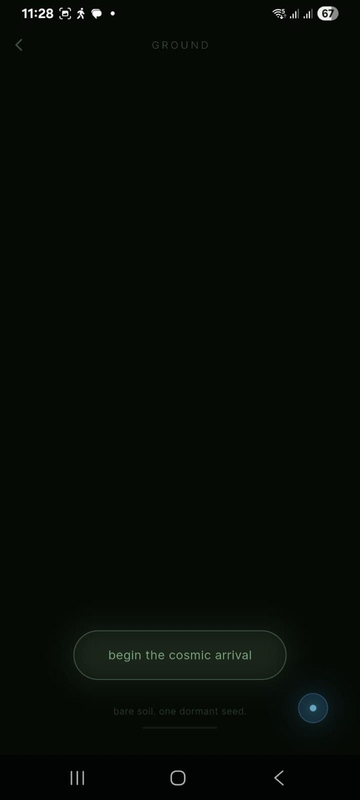
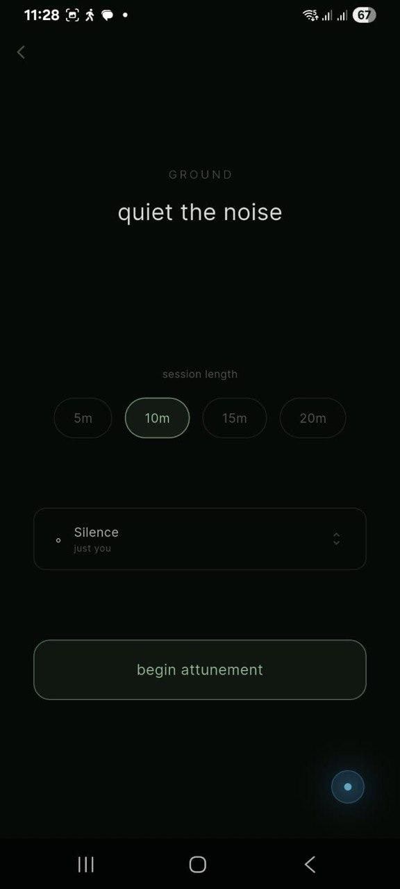
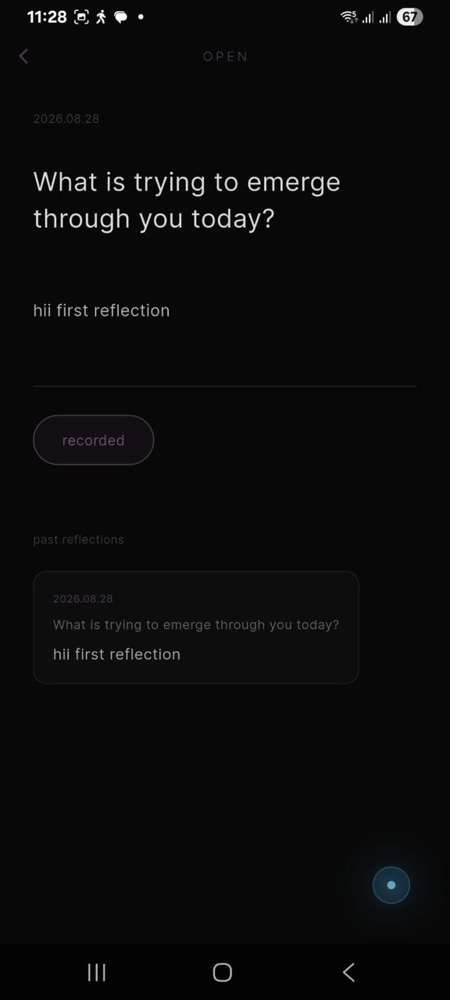

# WiandLo — *wisdom & love*

> *“Wisdom is knowing I am nothing, Love is knowing I am everything, and between the two my life moves.”*
> — **Nisargadatta Maharaj**

**WiandLo** is a quiet place to land.

Its name is the whole point: **Wi**sdom and **Lo**ve — not one pole or the other, but the living space *between* them, where Nisargadatta says a life moves. The app is that space, made touchable.

Most apps fight for your attention. WiandLo asks only for your presence.

A single dark, breathing world of five lands — GROUND, OPEN, SEE, LIVE, ROOTS — and one practice: show up, breathe, and let something grow. No streaks. No coins. No badges. Only a hand-painted world that turns a little greener every time you stay, and a voice that reminds you showing up is enough.

> **v1.0.0+1** — the **GROUND** world and the **Daily Inquiry** are awake.
> **SEE**, **LIVE** and **ROOTS** still slumber, sealed until their time.

---

## ✦ Five worlds, one practice

| World | Hue | State | Whispers |
|---|---|---|---|
| **GROUND** | soft green | ✅ live | *quiet the noise* — transmissions & free attunement. The soil remembers every session you complete. |
| **OPEN** | soft purple | 🟡 awake | self-inquiry — the Daily Inquiry is already here, waiting at the edge of every screen. |
| **SEE** | sky blue | 🔒 slumbering | *perception* — coming soon |
| **LIVE** | warm amber | 🔒 slumbering | *life* — coming soon |
| **ROOTS** | warm terracotta | 🔒 slumbering | *origins* — coming soon |

One door is open. That is enough to begin.

---

## ✦ Gallery — what waits in the dark

Seven moments, caught as they happened. This is what stillness looks like.















The gallery will grow as the worlds wake.

---

## ✦ What waits inside

### GROUND — a world that grows because you stayed
- **The living earth.** Every completed session plants more life into a hand-painted ecosystem — a `CustomPainter` draws the world live, and it climbs seven stages, from a bare seed to deep forest:

  | Sessions | Stage |
  |---|---|
  | 0 | dormant — *bare soil. one dormant seed.* |
  | 1–3 | cracking — *the seed cracks. something stirs.* |
  | 4–7 | seedling |
  | 8–14 | growing |
  | 15–25 | young tree |
  | 26–40 | blooming |
  | 41+ | forest — *ancient roots. primordial stillness.* |

- **Guided Transmissions** — recorded sessions meant to be heard *in order: each unlocks the next*. Two ship in v1.0 — *01 · Come to Presence* (5 min) and *02 · Cause & Effect I* (8 min). Auto-continue, ±10s seek, and a completion screen that demands nothing and forgives nothing.
- **Free Attunement** — your own pace, on a **4-4-6-2 breath** (in · hold · out · rest), for 5, 10, 15 or 20 minutes, wrapped in six looping soundscapes: **Silence · Temple · Night Road · Rain · Market · Forest**.
- **Showing up counts.** Leave early and nothing is counted — no growth, no ceremony, no lecture. The world only remembers the times you stayed.

### OPEN — the Daily Inquiry
- Ten questions that rotate with the date, so each dawn brings one new mirror: *“Who is aware of these thoughts?”*, *“What would silence say if it could speak?”*…
- A private journal — write what arises, save it, revisit your **past reflections**. All of it stays on your device.

### Safe Harbor
- A deep-cyan orb living on *every* screen — one tap, one grounding sound, wherever you are. A place to land before you decide to stay.

---

## ✦ Run it (if you dare)

**Prerequisites:** Flutter **3.x** (Dart 3) + your platform toolchain.

```bash
git clone <your-repo-url> && cd wiandlo
flutter pub get
flutter run                # or: flutter run -d chrome / -d linux
flutter analyze && flutter test
```

> `google_fonts` fetches Cormorant Garamond & Inter on first run — bundle them under `assets/` for fully offline builds.

**Audio assets** the code expects in `assets/audio/`:

| File | Used by |
|---|---|
| `G01_phase01.mp3` · `G01_phase02.mp3` | Guided tracks 01–02 |
| `temple.mp3` · `nightroad.mp3` · `rain.mp3` · `market.mp3` · `forest.mp3` | Free-mode soundscapes |
| `safe_harbor.mp3` | Safe Harbor orb *(drop in your own — until then it hums “not available yet”)* |

---

## ✦ The bones

| Layer | Choice |
|---|---|
| Framework | Flutter — Dart `>=3.0.0 <4.0.0` |
| Audio | `just_audio` — one shared player for every sound |
| Typography | `google_fonts` — Cormorant Garamond (whispers) + Inter (clarity) |
| Persistence | `shared_preferences` — sessions, unlocks, reflections |
| Animation | custom `CustomPainter`s — worlds drawn live, no image assets |

```
lib/
├── main.dart
├── theme/app_theme.dart
├── screens/
│   ├── overview/overview_screen.dart        # the five worlds
│   ├── open/daily_inquiry_screen.dart       # the daily question
│   └── ground/
│       ├── ground_world_screen.dart         # the living ecosystem
│       ├── ground_session_screen.dart       # transmissions & attunement
│       ├── ground_complete_screen.dart      # “you showed up.”
│       └── widgets/  (growth_stage · world_painter)
└── widgets/  safe_harbor · daily_inquiry_anchor
assets/        audio · images · rive (reserved for what wakes next)
screenshots/   ← the gallery above
```

**Slumbering groundwork:** `riverpod` · `go_router` · Firebase (core/auth/firestore/storage) · `hive_flutter` · `flutter_local_notifications` · `rive` — already declared, waiting for the worlds that need them.

---

## ✦ What wakes next

- [x] GROUND — transmissions, free attunement, a world that grows
- [x] OPEN — the Daily Inquiry
- [ ] SEE · LIVE · ROOTS awaken
- [ ] The full OPEN world
- [ ] Cloud sync — progress & reflections, everywhere
- [ ] A morning reminder for the Daily Inquiry
- [ ] Rive worlds, breathing with real motion
- [ ] A test suite (the quiet kind)

---

*Wisdom is knowing I am nothing. Love is knowing I am everything.*
*WiandLo is the space between — and now, it is yours to enter.*
